# Zurvan Product Delivery Demo - Sequence Diagram

This diagram shows the complete execution flow of the product delivery simulation system.

## Complete System Flow

```mermaid
sequenceDiagram
    participant User
    participant Simulation as ProductDeliverySimulation
    participant Graph as ZurvanGraph
    participant ManufNode as ResourceNode<br/>(Manufacturing Center)
    participant DistNode as ResourceNode<br/>(Distributor)
    participant Policy as PolicyNode
    participant Action as Action Function
    participant SimPy as SimPy Environment

    %% ===== INITIALIZATION PHASE =====
    Note over User,SimPy: 1. INITIALIZATION PHASE

    User->>Graph: load_graph_from_data(nodes.json)
    activate Graph
    Graph->>Graph: Parse JSON structure
    loop For each node in JSON
        Graph->>ManufNode: ResourceNode(env=None, node_id, type, data)
        activate ManufNode
        ManufNode->>ManufNode: _initialize_state()<br/>(inventory, production_rate, etc.)
        ManufNode-->>Graph: node object
        deactivate ManufNode
        Graph->>DistNode: ResourceNode(env=None, node_id, type, data)
        activate DistNode
        DistNode->>DistNode: _initialize_state()<br/>(orders_placed, etc.)
        DistNode-->>Graph: node object
        deactivate DistNode
    end
    Graph-->>User: graph with nodes
    deactivate Graph

    User->>Simulation: ProductDeliverySimulation(graph)
    activate Simulation
    Simulation->>SimPy: simpy.Environment()
    SimPy-->>Simulation: env
    loop For each node
        Simulation->>ManufNode: node.env = env
        Simulation->>DistNode: node.env = env
    end
    Simulation-->>User: simulation ready
    deactivate Simulation

    %% ===== ACTIVATION PHASE =====
    Note over User,SimPy: 2. ACTIVATION PHASE

    User->>Simulation: start_all_processes()
    activate Simulation

    Simulation->>ManufNode: start()
    activate ManufNode
    ManufNode->>ManufNode: _register_actions()<br/>(load from JSON config)
    ManufNode->>ManufNode: _get_automatic_actions()<br/>(filter auto_start=true)

    loop For each automatic action
        ManufNode->>ManufNode: _create_policy(policy_config)
        ManufNode->>Policy: ContinuousProductionPolicy()
        activate Policy
        Policy-->>ManufNode: policy instance

        ManufNode->>SimPy: env.process(_policy_driven_loop())
        activate SimPy
        SimPy-->>ManufNode: process handle
        deactivate SimPy

        ManufNode->>ManufNode: active_processes.append(process)
    end
    ManufNode-->>Simulation: processes started
    deactivate ManufNode

    Simulation->>DistNode: start()
    activate DistNode
    DistNode->>DistNode: _register_actions()
    DistNode->>DistNode: _get_automatic_actions()

    loop For each automatic action
        DistNode->>DistNode: _create_policy(policy_config)
        DistNode->>Policy: ContinuousOrderGenerationPolicy()
        Policy-->>DistNode: policy instance

        DistNode->>SimPy: env.process(_policy_driven_loop())
        activate SimPy
        SimPy-->>DistNode: process handle
        deactivate SimPy

        DistNode->>DistNode: active_processes.append(process)
    end
    DistNode-->>Simulation: processes started
    deactivate DistNode

    Simulation-->>User: all processes activated
    deactivate Simulation

    %% ===== EXECUTION PHASE - PRODUCTION =====
    Note over User,SimPy: 3. EXECUTION PHASE - PRODUCTION LOOP

    User->>Simulation: run_step(time_step=0.1)
    activate Simulation
    Simulation->>SimPy: env.run(until=now+0.1)
    activate SimPy

    SimPy->>ManufNode: resume _policy_driven_loop()
    activate ManufNode
    ManufNode->>Policy: should_continue(self)
    activate Policy
    Policy-->>ManufNode: True (always continue)
    deactivate Policy

    ManufNode->>Action: produce_batch(owner=self, resource=None,<br/>policy=policy, time=1.0)
    activate Action
    Action->>Action: current_rate = owner.state['production_rate']
    Action->>Action: owner.state['machine_state'] = 'producing'
    Action->>SimPy: yield env.timeout(1.0)
    Note over Action,SimPy: Action waits for 1.0 hours
    SimPy-->>Action: time advanced to now+1.0
    Action->>Action: units = rate * time<br/>owner.state['inventory'] += units<br/>owner.state['total_produced'] += units
    Action-->>ManufNode: production complete
    deactivate Action

    ManufNode->>Policy: get_next_interval(self)
    activate Policy
    Policy-->>ManufNode: 0.0 (no wait)
    deactivate Policy

    ManufNode->>ManufNode: Loop back to should_continue()
    deactivate ManufNode

    SimPy-->>Simulation: time advanced
    deactivate SimPy
    Simulation-->>User: step complete
    deactivate Simulation

    %% ===== EXECUTION PHASE - ORDER GENERATION =====
    Note over User,SimPy: 4. EXECUTION PHASE - ORDER GENERATION

    User->>Simulation: run_step(time_step=0.1)
    activate Simulation
    Simulation->>SimPy: env.run(until=now+0.1)
    activate SimPy

    SimPy->>DistNode: resume _policy_driven_loop()
    activate DistNode
    DistNode->>Policy: should_continue(self)
    activate Policy
    Policy-->>DistNode: True (always continue)
    deactivate Policy

    DistNode->>Action: check_and_generate_order(owner=self,<br/>resource=graph, policy=policy, time=0.1)
    activate Action
    Action->>Action: day = int(now/24) % 7<br/>prob = order_probabilities[day]<br/>if random() < prob:
    Action->>SimPy: yield env.timeout(0.1)
    SimPy-->>Action: time advanced
    Action->>Action: order = Order(distributor_id, quantity, time)
    Action->>Graph: find_nearest_center(distributor_id)
    activate Graph
    Graph-->>Action: nearest_center_id, distance
    deactivate Graph
    Action->>ManufNode: state['pending_orders'].append(order)
    activate ManufNode
    ManufNode-->>Action: order added
    deactivate ManufNode
    Action->>DistNode: owner.state['orders_placed'] += 1<br/>owner.state['total_order_quantity'] += quantity
    Action-->>DistNode: order generated
    deactivate Action

    DistNode->>Policy: get_next_interval(self)
    activate Policy
    Policy-->>DistNode: 2.0 (check every 2 hours)
    deactivate Policy

    DistNode->>SimPy: yield env.timeout(2.0)
    Note over DistNode,SimPy: Wait 2 hours before next check
    SimPy-->>DistNode: resumed after 2 hours
    DistNode->>DistNode: Loop back to should_continue()
    deactivate DistNode

    SimPy-->>Simulation: time advanced
    deactivate SimPy
    Simulation-->>User: step complete
    deactivate Simulation

    %% ===== EXECUTION PHASE - ORDER FULFILLMENT =====
    Note over User,SimPy: 5. EXECUTION PHASE - ORDER FULFILLMENT

    User->>Simulation: run_step(time_step=0.1)
    activate Simulation
    Simulation->>SimPy: env.run(until=now+0.1)
    activate SimPy

    SimPy->>ManufNode: resume _policy_driven_loop()<br/>(order fulfillment process)
    activate ManufNode
    ManufNode->>Policy: should_continue(self)
    activate Policy
    Policy-->>ManufNode: True (always continue)
    deactivate Policy

    ManufNode->>Action: check_and_fulfill_orders(owner=self,<br/>resource=None, policy=policy, time=0.1)
    activate Action
    Action->>Action: pending_orders = owner.state['pending_orders']

    loop While pending_orders and inventory available
        Action->>Action: oldest_order = pending_orders[0]<br/>if inventory >= order.quantity:
        Action->>SimPy: yield env.timeout(0.1)
        SimPy-->>Action: time advanced
        Action->>Action: owner.state['inventory'] -= quantity<br/>order.status = 'fulfilled'<br/>order.fulfillment_time = now
        Action->>Action: wait_time = fulfillment_time - placement_time<br/>if wait_time > 48:<br/>    sla_violations += 1
        Action->>Action: owner.state['total_orders_fulfilled'] += 1<br/>pending_orders.pop(0)
    end

    Action-->>ManufNode: orders fulfilled
    deactivate Action

    ManufNode->>Policy: get_next_interval(self)
    activate Policy
    Policy-->>ManufNode: 1.0 (check every hour)
    deactivate Policy

    ManufNode->>SimPy: yield env.timeout(1.0)
    Note over ManufNode,SimPy: Wait 1 hour before next check
    SimPy-->>ManufNode: resumed after 1 hour
    ManufNode->>ManufNode: Loop back to should_continue()
    deactivate ManufNode

    SimPy-->>Simulation: time advanced
    deactivate SimPy
    Simulation-->>User: step complete
    deactivate Simulation

    deactivate Policy

    %% ===== CONTINUOUS EXECUTION =====
    Note over User,SimPy: 6. CONTINUOUS EXECUTION

    loop Simulation Running
        User->>Simulation: run_step(0.1)
        Note over Simulation,SimPy: All processes execute concurrently:<br/>- Production (continuous)<br/>- Order generation (every 2 hrs)<br/>- Order fulfillment (every 1 hr)
        Simulation->>SimPy: env.run(until=now+0.1)
        SimPy->>SimPy: Process all events up to now+0.1
        SimPy-->>Simulation: time advanced
        Simulation-->>User: state updated
    end
```



## Key Architecture Patterns

### 1. Data-Driven Action System
- Actions are configured in `data/nodes.json`, NOT hardcoded in Python
- Nodes dynamically load actions using `importlib` and reflection
- No if/elif chains for action registration

### 2. Policy-Driven Execution
- Actions execute in loops controlled by PolicyNode objects
- Policies determine:
  - `should_continue()`: Whether to keep executing
  - `get_next_interval()`: How long to wait before next execution
  - `modify_parameters()`: How to adapt action parameters

### 3. Autonomous Agent Pattern
- Nodes are self-managing agents that start their own processes
- Call `node.start()` to activate automatic actions
- No manual process registration needed

### 4. Clean Action Signature
All actions follow the 4-parameter signature:
```python
def action(owner, resource, policy, time):
    # owner: ResourceNode executing the action
    # resource: Required resources (or None)
    # policy: PolicyNode controlling execution
    # time: Time parameter for this execution
    yield owner.env.timeout(time)
```

## State Flow Summary

```
JSON Config → Graph Builder → ResourceNodes (with state)
                                    ↓
                            SimPy Environment attached
                                    ↓
                            start_all_processes()
                                    ↓
                    Nodes load actions & policies from JSON
                                    ↓
                    Nodes start policy-driven loops
                                    ↓
                Policy checks should_continue() → True
                                    ↓
                Action executes (yields timeout)
                                    ↓
                SimPy advances time
                                    ↓
                Action updates state
                                    ↓
                Policy gets next interval
                                    ↓
                SimPy waits for interval
                                    ↓
                Loop repeats (back to should_continue)
```

## Time Management

**Discrete Event Simulation**: SimPy processes events in sequence
- Actions yield `env.timeout(time)` to advance simulation time
- Multiple processes run concurrently (production, order gen, fulfillment)
- `run_step(time_step)` advances time by up to `time_step` hours
- Real-time visualization uses small time steps (0.1 hours = 6 minutes)

## Inter-Node Communication

**Order Flow**:
1. Distributor generates order (probabilistically based on day-of-week)
2. Order routes to nearest manufacturing center (via graph.find_nearest_center)
3. Order added to center's `pending_orders` queue
4. Manufacturing center checks queue periodically (every 1 hour)
5. Center fulfills orders FIFO when inventory available
6. State updates: inventory decremented, metrics incremented

**No Direct Messaging**: Nodes communicate through shared state (orders in queues)
